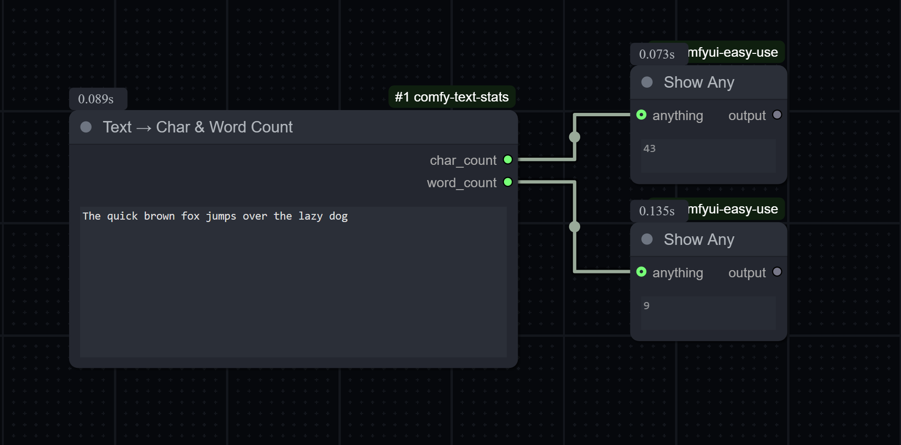

# 🧩 Comfy Text Stats (Char & Word Count)

A lightweight **ComfyUI custom node** that receives a text string and outputs:

- 🧮 **Character count** (`INT`)
- ✍️ **Word count** (`INT`)

This node is designed for text preprocessing, caption analytics, or quick statistics inside your ComfyUI workflows.

---

## 🚀 Features

✅ Simple and fast — no dependencies  
✅ Unicode-aware word detection (supports multilingual text)  
✅ Deterministic results (not affected by seeds)  
✅ Works with any `STRING` input from other nodes  



---

## 📦 Installation

### **Option 1 — Via ComfyUI-Manager (recommended)**

1. Download [`comfy-text-stats.zip`](./comfy-text-stats.zip)  
2. In **ComfyUI-Manager**, go to:  
   **Install → Install from ZIP**
3. Select the ZIP file and click **Install**  
4. Then **Reload Custom Nodes** (or restart ComfyUI)

### **Option 2 — Manual Install**

1. Extract the folder to your ComfyUI custom node directory:
   ```
   ComfyUI/
   └── custom_nodes/
       └── comfy-text-stats/
           ├── __init__.py
           ├── text_stats.py
           ├── README.md
           └── requirements.txt
   ```
2. Restart ComfyUI.

---

## 🧠 Usage

### Node name
> **Text Stats (Char & Word Count)**  
Category: `Text / Utils`

### Inputs
| Name | Type | Description |
|------|------|--------------|
| `text` | STRING | The text input to analyze. Supports multiline input. |

### Outputs
| Name | Type | Description |
|------|------|--------------|
| `char_count` | INT | Number of characters (including spaces, punctuation, and newlines). |
| `word_count` | INT | Number of words (using Unicode-aware regex). |

---

## 🧪 Example

**Input text:**
```
ComfyUI makes custom nodes easy!
```

**Outputs:**
```
char_count = 33
word_count = 5
```

---

## 🔧 Technical Details

- Word detection uses the regex:  
  ```python
  \b\w+\b
  ```
  which matches Unicode word boundaries.
- The node is deterministic (`IS_CHANGED` checks text length for caching).

---

## 💡 Use Cases

- Text preprocessing for captioning or prompt tuning  
- Generating text metadata before feeding into LLM pipelines  
- Measuring caption sizes in dataset workflows  

---

## 📄 License

MIT License © 2025 — freely usable and modifiable.  
Contributions welcome!
